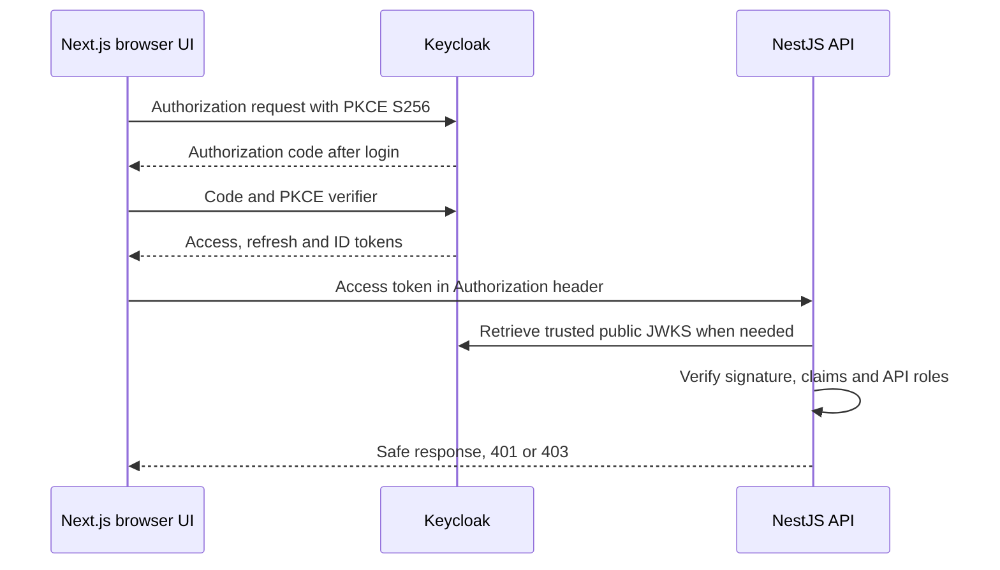

# Architecture and security boundaries

## Request flow

Tokens are retained only in browser memory. The API does not accept browser-decoded claims as proof of identity, does not handle passwords, and does not need a Keycloak client secret.

## Frontend

- Next.js App Router renders a public authentication-lab shell. `AuthProvider` initializes a browser-only Keycloak adapter after hydration.
- A per-page `AuthSession` singleton and one initialization promise prevent repeated adapter initialization under React Strict Mode or hot reload. Server rendering does not share a session between users.
- The adapter uses standard Authorization Code flow, PKCE S256 and `check-sso`. No implicit flow, password grant or silent iframe is implemented.
- `checkLoginIframe` is disabled. Regular top-level SSO checks avoid reliance on silent third-party-cookie checks; a page load can therefore redirect briefly. Cross-tab/remote logout is noticed on a subsequent refresh or new SSO check, not instantly via the Keycloak iframe.
- Automatic refresh checks every 20 seconds while authenticated. Protected API calls also call `updateToken(30)` before sending the token. Concurrent requests share the same pending refresh. A manual refresh uses `updateToken(-1)`.
- Refresh failure removes local auth state. Logout constructs the Keycloak URL first so its ID-token hint is available, clears local state, then redirects. A late refresh cannot repopulate a logged-out session.
- Only fixed API routes on the configured API origin are called. Fetch omits cookies, rejects redirects, disables caching and times out after 12 seconds. There is no automatic infinite retry loop.
- The identity panel never prints the full token. Local role checks only improve the UI; they do not authorize server operations.

This is a browser-token architecture. Before adding sensitive data or server-rendered personalized pages, evaluate a BFF with secure, HttpOnly cookie sessions versus retaining the SPA approach. A switch requires an explicit CSRF/session design, not merely moving the token into a cookie.

## Backend

- Native ESM NestJS with `jose` JWT verification. RS256 is explicitly allowed; header-controlled remote key URLs and arbitrary algorithms are not trusted.
- The trusted JWKS endpoint is derived from the configured HTTPS issuer. The resolver is a process singleton, caches keys for 10 minutes, has a 30-second refresh cooldown and a 5-second network timeout. Planned signing-key rotation should publish the new public key before using it. Tests exercise cache reuse and rotation against a local JWKS server.
- Verification requires `iss`, `aud`, `sub`, `exp` and `iat`, checks optional `nbf`, permits five seconds of clock skew, rejects a future `iat`, and requires the Keycloak access-token payload type `Bearer`.
- Roles come only from `resource_access[KEYCLOAK_AUDIENCE].roles`. Realm roles, roles for another client, headers and query parameters cannot grant API privileges.
- Authentication is a global guard: new routes are protected unless explicitly decorated with `@Public()`. `@Roles('user', 'admin')` means either role; `@Roles('admin')` is admin-only.
- `@CurrentUser()` reads the verified request identity. Safe response fields are intentionally selected; raw claims and tokens are not returned.
- CORS specifies the exact frontend origin and does not allow credentialed cookie requests. CORS is a browser control, not a replacement for authentication or protection against non-browser callers.
- Helmet, no-store responses, request IDs, safe exception formatting, validation defaults and graceful shutdown are enabled. Token-verification failures are logged as generic events without tokens or raw exception details.
- `GET /api/health` is liveness only. It must not be presented as a Keycloak readiness check.

The `tsx` development runner does not emit TypeScript decorator metadata. Injectable constructor dependencies therefore use explicit `@Inject(...)` tokens. Keep that convention for new Nest providers so development and compiled production behave consistently.

## Tests

Backend tests use freshly generated RSA keys and a local JWKS HTTP fixture. They verify real signatures, claim validation, role boundaries, CORS and key caching/rotation without your realm or a test password. Frontend tests use an injected adapter double to exercise lifecycle, concurrency, API errors, loading state and safe identity display. Mocking exists in test fixtures only; runtime login uses the real `keycloak-js` adapter.

See [VERIFICATION.md](VERIFICATION.md) for actual results and limitations. A passing offline suite is not proof that your live client settings are correct.

## Before a real deployment

- Finish the manual login, logout, refresh and role matrix against the intended realm. Use a separate development/staging realm if local testing should be isolated from future production accounts.
- Choose production frontend/API hostnames, HTTPS routing, precise redirect/logout URIs and Web origins. Set API `NODE_ENV=production` and an HTTPS `FRONTEND_ORIGIN`; rebuild the frontend with production public variables.
- Preserve your existing Nginx/Certbot setup unless you explicitly plan a migration. This ZIP provides no VPS mutation or deployment scripts and opens no public listening ports by default.
- Add a tested frontend Content Security Policy compatible with Next.js and the chosen auth flow, edge/application rate limits, resource limits and abuse protection. The basic response headers in this starter are not a complete production-hardening policy.
- Configure SMTP, password/registration policy and appropriate MFA, particularly for administrative accounts. Keep bootstrap admins removed and limit permanent administration access.
- Decide how quickly logout, disabled accounts and role changes must revoke access; short-lived JWTs do not provide immediate revocation. Avoid pretending that clearing browser tokens invalidates copies already issued.
- Review dependency advisories and upgrade on a controlled cadence. Keep the lockfile and rerun tests. TypeScript 5.9 and ESLint 9 are retained for the tested toolchain; do not force incompatible peer dependencies during an upgrade.
- Prevent auth headers, codes and tokens from entering proxy logs, analytics or crash-reporting payloads. No token should go in an API query string.
- Add backups, recovery tests, monitoring and privacy/retention policy before storing real financial or personal data.

## Next product phase

There is intentionally no application database yet. A sensible next vertical slice is a user-owned expense list with amount, currency, date and category. Agree on that model before implementation.

When an application database is added, identify users by the verified **issuer + subject (`iss`, `sub`)**, not by mutable email or username. Do not read or reuse Keycloak's internal database. Every record-level query must enforce ownership server-side. Store monetary values using a deliberate integer-minor-unit or decimal strategy, never unchecked binary floating-point arithmetic. Add cross-user access tests before shipping any expense endpoints.
